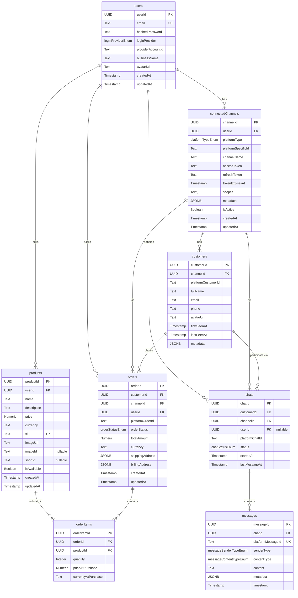

# Project Architecture Documentation

This document outlines the architecture for the database schema, backend services, and the Next.js API routes.

## 1. Database Schema (`db/schema.ts`)

The database schema is defined using Drizzle ORM and resides in `db/schema.ts`. It is designed to support a multi-channel customer interaction platform.

### 1.1. Core Entities and Fields

Below is a description of the main tables and their fields:

**Table: `users`**
Stores information about business users.

| Column              | Type                                  | Constraints                                  | Description                                      |
|---------------------|---------------------------------------|----------------------------------------------|--------------------------------------------------|
| `userId`            | `uuid`                                | PK, `default gen_random_uuid()`              | Unique identifier for the user.                  |
| `email`             | `text`                                | Unique, Not Null                             | User's email address.                            |
| `hashedPassword`    | `text`                                |                                              | Hashed password for email/password auth.         |
| `loginProvider`     | `loginProviderEnum`                   |                                              | OAuth provider (EMAIL, GOOGLE, etc.).            |
| `providerAccountId` | `text`                                |                                              | Account ID from the OAuth provider.              |
| `businessName`      | `text`                                |                                              | Name of the user's business.                     |
| `avatarUrl`         | `text`                                |                                              | URL to the user's avatar image.                  |
| `createdAt`         | `timestamp`                           | Not Null, `default now()`                    | Timestamp of user creation.                      |
| `updatedAt`         | `timestamp`                           | Not Null, `default now()`                    | Timestamp of last user update.                   |
*Relations: Has many `connectedChannels`, `products`, `orders` (as seller/agent), `chats` (as agent).*

**Table: `connectedChannels`**
Manages connections to various external platforms for each user.

| Column               | Type                 | Constraints                                  | Description                                         |
|----------------------|----------------------|----------------------------------------------|-----------------------------------------------------|
| `channelId`          | `uuid`               | PK, `default gen_random_uuid()`              | Unique identifier for the connected channel.        |
| `userId`             | `uuid`               | FK to `users.userId`, Not Null               | Owning user.                                        |
| `platformType`       | `platformTypeEnum`   | Not Null                                     | Type of platform (WHATSAPP, SHOPIFY, etc.).         |
| `platformSpecificId` | `text`               |                                              | ID from the external platform.                      |
| `channelName`        | `text`               |                                              | User-defined name for the channel.                  |
| `accessToken`        | `text`               |                                              | Encrypted access token for the platform API.        |
| `refreshToken`       | `text`               |                                              | Encrypted refresh token.                            |
| `tokenExpiresAt`     | `timestamp`          |                                              | Expiry time for the access token.                   |
| `scopes`             | `text[]`             |                                              | OAuth scopes granted.                               |
| `metadata`           | `jsonb`              |                                              | Other platform-specific settings.                   |
| `isActive`           | `boolean`            | `default true`                               | Whether the channel connection is active.           |
| `createdAt`          | `timestamp`          | Not Null, `default now()`                    | Timestamp of channel creation.                      |
| `updatedAt`          | `timestamp`          | Not Null, `default now()`                    | Timestamp of last channel update.                   |
*Relations: Belongs to `user`. Has many `customers`, `orders`, `chats`.*

**Table: `products`**
Stores product information for users.

| Column        | Type          | Constraints                                  | Description                                      |
|---------------|---------------|----------------------------------------------|--------------------------------------------------|
| `productId`   | `uuid`        | PK, `default gen_random_uuid()`              | Unique identifier for the product.               |
| `userId`      | `uuid`        | FK to `users.userId`, Not Null               | User who owns the product.                       |
| `name`        | `text`        | Not Null                                     | Product name.                                    |
| `description` | `text`        |                                              | Product description.                             |
| `price`       | `numeric(10,2)` | Not Null                                     | Product price.                                   |
| `currency`    | `text`        | Not Null                                     | Currency code (e.g., "USD").                     |
| `sku`         | `text`        | Unique                                       | Stock Keeping Unit.                              |
| `imageUrl`    | `text`        |                                              | URL to the product image.                        |
| `imageId`     | `text`        |                                              | Optional ID for an image associated with the product. |
| `shortId`     | `text`        |                                              | Optional short identifier for the product.       |
| `isAvailable` | `boolean`     | `default true`                               | Whether the product is available for sale.       |
| `createdAt`   | `timestamp`   | Not Null, `default now()`                    | Timestamp of product creation.                   |
| `updatedAt`   | `timestamp`   | Not Null, `default now()`                    | Timestamp of last product update.                |
*Relations: Belongs to `user`. Has many `orderItems`.*

**Table: `customers`**
Represents end-customers interacting via connected channels.

| Column               | Type        | Constraints                                  | Description                                      |
|----------------------|-------------|----------------------------------------------|--------------------------------------------------|
| `customerId`         | `uuid`      | PK, `default gen_random_uuid()`              | Unique identifier for the customer.              |
| `channelId`          | `uuid`      | FK to `connectedChannels.channelId`, Not Null| Channel through which customer interacted.       |
| `platformCustomerId` | `text`      | Not Null                                     | Customer ID from the external platform.          |
| `fullName`           | `text`      |                                              | Customer's full name.                            |
| `email`              | `text`      |                                              | Customer's email address.                        |
| `phone`              | `text`      |                                              | Customer's phone number.                         |
| `avatarUrl`          | `text`      |                                              | URL to customer's avatar.                        |
| `firstSeenAt`        | `timestamp` | Not Null, `default now()`                    | Timestamp of first interaction.                  |
| `lastSeenAt`         | `timestamp` | Not Null, `default now()`                    | Timestamp of last interaction.                   |
| `metadata`           | `jsonb`     |                                              | Additional customer data.                        |
*Relations: Belongs to `connectedChannel`. Has many `orders`, `chats`.*

**Table: `orders`**
Tracks customer orders.

| Column            | Type                | Constraints                                  | Description                                      |
|-------------------|---------------------|----------------------------------------------|--------------------------------------------------|
| `orderId`         | `uuid`              | PK, `default gen_random_uuid()`              | Unique identifier for the order.                 |
| `customerId`      | `uuid`              | FK to `customers.customerId`, Not Null       | Customer who placed the order.                   |
| `channelId`       | `uuid`              | FK to `connectedChannels.channelId`, Not Null| Channel through which order was placed.          |
| `userId`          | `uuid`              | FK to `users.userId`, Not Null               | User/business fulfilling the order.              |
| `platformOrderId` | `text`              |                                              | Order ID from the external platform, if any.     |
| `orderStatus`     | `orderStatusEnum`   | Not Null, `default 'PENDING'`                | Status of the order.                             |
| `totalAmount`     | `numeric(10,2)`     | Not Null                                     | Total amount of the order.                       |
| `currency`        | `text`              | Not Null                                     | Currency code for the order.                     |
| `shippingAddress` | `jsonb`             |                                              | Shipping address details.                        |
| `billingAddress`  | `jsonb`             |                                              | Billing address details.                         |
| `createdAt`       | `timestamp`         | Not Null, `default now()`                    | Timestamp of order creation.                     |
| `updatedAt`       | `timestamp`         | Not Null, `default now()`                    | Timestamp of last order update.                  |
*Relations: Belongs to `customer`, `connectedChannel`, `user`. Has many `orderItems`.*

**Table: `orderItems`**
Line items for an order.

| Column               | Type            | Constraints                                  | Description                                      |
|----------------------|-----------------|----------------------------------------------|--------------------------------------------------|
| `orderItemId`        | `uuid`          | PK, `default gen_random_uuid()`              | Unique identifier for the order item.            |
| `orderId`            | `uuid`          | FK to `orders.orderId`, Not Null             | Order this item belongs to.                      |
| `productId`          | `uuid`          | FK to `products.productId`, Not Null         | Product associated with this item.               |
| `quantity`           | `integer`       | Not Null                                     | Quantity of the product ordered.                 |
| `priceAtPurchase`    | `numeric(10,2)` | Not Null                                     | Price of the product at the time of purchase.    |
| `currencyAtPurchase` | `text`          | Not Null                                     | Currency at the time of purchase.                |
*Relations: Belongs to `order`, `product`.*

**Table: `chats`**
Represents chat conversations.

| Column           | Type             | Constraints                                  | Description                                      |
|------------------|------------------|----------------------------------------------|--------------------------------------------------|
| `chatId`         | `uuid`           | PK, `default gen_random_uuid()`              | Unique identifier for the chat.                  |
| `customerId`     | `uuid`           | FK to `customers.customerId`, Not Null       | Customer involved in the chat.                   |
| `channelId`      | `uuid`           | FK to `connectedChannels.channelId`, Not Null| Channel on which chat occurred.                  |
| `userId`         | `uuid`           | FK to `users.userId` (nullable)              | Assigned agent/user.                             |
| `platformChatId` | `text`           |                                              | Chat ID from the external platform.              |
| `status`         | `chatStatusEnum` | Not Null, `default 'OPEN'`                   | Status of the chat.                              |
| `startedAt`      | `timestamp`      | Not Null, `default now()`                    | Timestamp when chat started.                     |
| `lastMessageAt`  | `timestamp`      |                                              | Timestamp of the last message in the chat.       |
*Relations: Belongs to `customer`, `connectedChannel`, `user` (optional). Has many `messages`.*

**Table: `messages`**
Individual messages within a chat.

| Column              | Type                      | Constraints                                  | Description                                      |
|---------------------|---------------------------|----------------------------------------------|--------------------------------------------------|
| `messageId`         | `uuid`                    | PK, `default gen_random_uuid()`              | Unique identifier for the message.               |
| `chatId`            | `uuid`                    | FK to `chats.chatId`, Not Null               | Chat this message belongs to.                    |
| `platformMessageId` | `text`                    | Unique                                       | Message ID from the external platform.           |
| `senderType`        | `messageSenderTypeEnum`   | Not Null                                     | Who sent the message (CUSTOMER, AGENT, SYSTEM).  |
| `contentType`       | `messageContentTypeEnum`  | Not Null, `default 'TEXT'`                   | Type of message content (TEXT, IMAGE, etc.).     |
| `content`           | `text`                    | Not Null                                     | Message content (text or URL for media).         |
| `metadata`          | `jsonb`                   |                                              | Additional message data.                         |
| `timestamp`         | `timestamp`               | Not Null, `default now()`                    | Timestamp when message was sent/received.        |
*Relations: Belongs to `chat`.*

### 1.2. Enum Types

The schema defines several PostgreSQL enum types for consistency:

*   `platformTypeEnum`: For `connectedChannels.platformType` (e.g., 'WHATSAPP', 'INSTAGRAM', 'SHOPIFY')
*   `loginProviderEnum`: For `users.loginProvider` (e.g., 'EMAIL', 'GOOGLE', 'FACEBOOK')
*   `orderStatusEnum`: For `orders.orderStatus` (e.g., 'PENDING', 'PROCESSING', 'SHIPPED', 'DELIVERED', 'CANCELLED', 'REFUNDED')
*   `chatStatusEnum`: For `chats.status` (e.g., 'OPEN', 'PENDING', 'RESOLVED', 'CLOSED')
*   `messageSenderTypeEnum`: For `messages.senderType` (e.g., 'CUSTOMER', 'AGENT', 'SYSTEM')
*   `messageContentTypeEnum`: For `messages.contentType` (e.g., 'TEXT', 'IMAGE', 'VIDEO', 'AUDIO', 'FILE', 'LOCATION', 'STICKER')

### 1.3. Mermaid Diagram (Entity Relationship Diagram)


This diagram provides a visual overview of the table relationships.

---

## 2. Backend Services Architecture

The backend services are responsible for handling business logic and data persistence. They are designed to be modular and interact with the database via Drizzle ORM.

### 2.1. Directory Structure

Services are organized within the `backend/services/` directory. Each entity has its own subdirectory:

```
backend/
└── services/
    ├── [entityName]/
    │   ├── [entityName].service.ts  // Contains business logic and database operations
    │   └── [entityName].types.ts    // Contains TypeScript type definitions for the entity
    ├── users/
    │   ├── users.service.ts
    │   └── users.types.ts
    ├── products/
    │   ├── products.service.ts
    │   └── products.types.ts
    ├── channels/
    │   ├── channels.service.ts
    │   └── channels.types.ts
    ├── customers/
    │   ├── customers.service.ts
    │   └── customers.types.ts
    ├── orders/
    │   ├── orders.service.ts
    │   └── orders.types.ts
    ├── chats/
    │   ├── chats.service.ts
    │   └── chats.types.ts
    └── messages/
        ├── messages.service.ts
        └── messages.types.ts
```

### 2.2. Service Files (`*.service.ts`)

*   **Purpose:** Encapsulate all business logic related to a specific entity. This includes creating, reading, updating, and deleting (CRUD) operations, as well as any other entity-specific logic.
*   **Database Interaction:** Service files directly interact with the database using the Drizzle ORM client (`db` imported from `@/db`).
*   **Structure:** Each service is implemented as a class (e.g., `UsersService`) with methods corresponding to various operations. An instance of the service is usually exported for use in API route handlers.
*   **Example Operations:** `createUser`, `getUserById`, `getAllUsers`, `updateUser`, `deleteUser`.
*   **Relational Data:** Services handle fetching related data (e.g., a user's orders) using Drizzle's relational query capabilities (`db.query.[entity].findFirst/findMany({ with: { ... } })`).
*   **Transactions:** For operations involving multiple database writes (e.g., creating an order and its items), Drizzle transactions (`db.transaction(async (tx) => { ... })`) are used to ensure atomicity.

### 2.3. Type Definition Files (`*.types.ts`)

*   **Purpose:** Define all TypeScript types related to an entity. This ensures type safety throughout the application.
*   **Core Types:**
    *   `Entity`: Derived from the Drizzle schema using `InferSelectModel<typeof schema.[entityTable]>`. Represents the shape of data retrieved from the database.
    *   `NewEntity`: Derived from the Drizzle schema using `InferInsertModel<typeof schema.[entityTable]>`. Represents the shape of data for creating new records.
*   **Custom Types:**
    *   `CreateEntityData`: Defines the data structure required to create a new entity (often an `Omit` of `NewEntity` to exclude auto-generated fields like `id`, `createdAt`).
    *   `UpdateEntityData`: Defines the data structure for updating an entity (often a `Partial<Omit<...>>`).
    *   `GetEntityByIdOptions`, `GetAllEntitiesOptions`: Define options for fetching entities, including pagination, filtering, and inclusion of related data.
    *   `EntityFilterOptions`: Defines specific filter criteria for querying entities.
    *   `EntityWithIncludes`: Defines the shape of an entity when related data is included.

### 2.4. Database Setup (`db/index.ts`)

*   Initializes and exports the Drizzle ORM client instance (`db`).
*   Configured to connect to a Neon serverless Postgres database using the `@neondatabase/serverless` driver and `drizzle-orm/neon-http` adapter.
*   The database connection string is expected to be provided via the `DATABASE_URL` environment variable.

### 2.5. ESLint Configuration (`eslint.config.mjs`)

*   The `@typescript-eslint/no-unused-vars` rule has been globally disabled (`"off"`).
*   **Reasoning:** Drizzle ORM's relational query system often requires importing schema table objects (e.g., `import { users, orders } from '@/db/schema'`) into service files for type inference and query building, even if these imported table objects are not explicitly used as standalone variables within the service file's code. Disabling this rule prevents ESLint errors for these legitimate, Drizzle-specific use cases. This also applies to type definition files (`*.types.ts`) where schema objects might be imported for type derivation but not directly used as values.

## 3. Next.js API Routes Architecture (App Router)

API routes are built using Next.js App Router conventions, residing in the `app/api/` directory.

### 3.1. Directory Structure

API routes are organized by entity, following RESTful patterns:

```
app/
└── api/
    ├── [entityName]/
    │   ├── route.ts                     // Handles /api/[entityName] (e.g., GET all, POST create)
    │   └── [entityId]/                  // Next.js convention for dynamic segments
    │       └── route.ts                 // Handles /api/[entityName]/[entityId] (e.g., GET one, PUT update, DELETE one)
    ├── users/
    │   ├── route.ts
    │   └── [userId]/
    │       └── route.ts
    ├── products/
    │   ├── route.ts
    │   └── [productId]/
    │       └── route.ts
    ├── channels/
    │   ├── route.ts
    │   └── [channelId]/
    │       └── route.ts
    ├── customers/
    │   ├── route.ts
    │   └── [customerId]/
    │       └── route.ts
    ├── orders/
    │   ├── route.ts
    │   └── [orderId]/
    │       └── route.ts
    ├── chats/
    │   ├── route.ts
    │   └── [chatId]/
    │       ├── route.ts
    │       └── messages/                // Sub-resource example: messages for a chat
    │           └── route.ts             // Handles /api/chats/[chatId]/messages
    └── messages/
        └── [messageId]/
            └── route.ts                 // Handles /api/messages/[messageId] (e.g., for updating/deleting a specific message)
```

### 3.2. Route Handlers (`route.ts`)

*   **HTTP Methods:** Each `route.ts` file exports async functions corresponding to HTTP methods (e.g., `export async function GET(request: NextRequest, { params }) { ... }`, `POST`, `PUT`, `DELETE`).
*   **Request & Response:** Utilize `NextRequest` for accessing request details and `NextResponse.json()` for sending JSON responses with appropriate status codes.
*   **Service Integration:** Route handlers call methods from the corresponding backend service (e.g., `usersService.createUser(...)`).
*   **Input Validation:**
    *   Request bodies, query parameters, and path parameters will be validated using Zod schemas.
    *   Zod schemas will be defined either co-located with routes or in a shared validation module.
*   **Error Handling:**
    *   `try...catch` blocks are used to handle errors from service calls or validation.
    *   Zod validation errors return a `400 Bad Request` with error details.
    *   Other server-side errors return a `500 Internal Server Error` with a generic message, and actual errors are logged server-side.
    *   Not Found errors (e.g., for `GET /api/entity/[id]`) return a `404 Not Found`.
*   **Authentication & Authorization:** (Conceptual) Protected routes would typically involve middleware or checks at the beginning of each handler to verify user authentication and authorization. This is not yet implemented but is a key consideration.

### 3.3. Planned API Endpoints (Summary)

For each entity (users, products, channels, customers, orders, chats, messages), the following general API endpoints are planned:

*   **`POST /api/[entity]`**: Create a new entity.
*   **`GET /api/[entity]`**: Get a list of entities (with pagination and filtering).
*   **`GET /api/[entity]/[id]`**: Get a single entity by its ID.
*   **`PUT /api/[entity]/[id]`**: Update an entity by its ID.
*   **`DELETE /api/[entity]/[id]`**: Delete an entity by its ID.

Specific sub-resources, like messages within a chat (`/api/chats/[chatId]/messages`), will also be implemented.

This plan provides a foundation for building robust and maintainable API endpoints.
