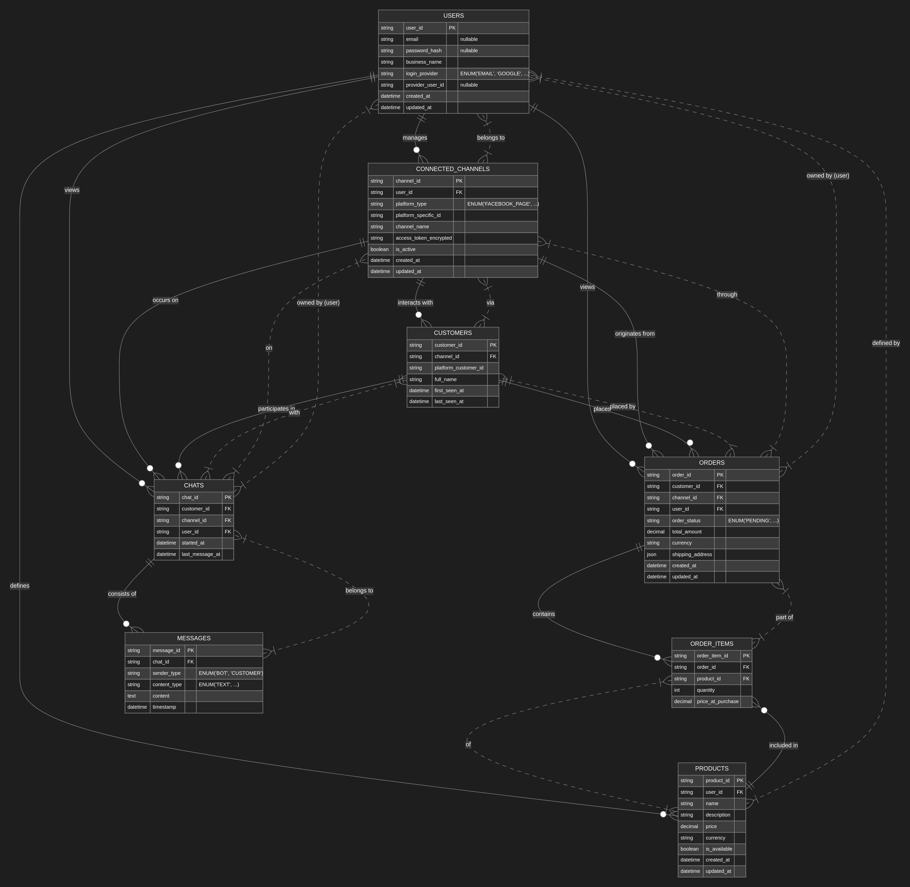
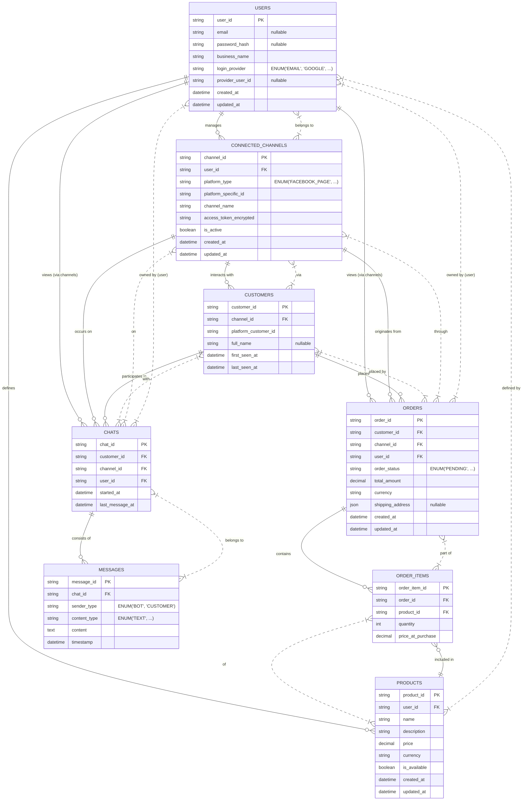

# System Architecture: Multi-Channel AI Bot Service

## 1. Introduction

This document outlines the database architecture for a multi-channel AI bot service. The service enables businesses (Users) to connect their social media and messaging platform accounts (Channels) to automate customer interactions, manage orders, and log conversations using AI-powered bots.

## 2. Database Schema

The following tables define the structure of the database.

### 2.1. `Users`

Represents the businesses signing up for the service.

| Column             | Type                                      | Constraints / Notes                                     |
|--------------------|-------------------------------------------|---------------------------------------------------------|
| `user_id`          | STRING / UUID                             | Primary Key (PK)                                        |
| `email`            | STRING                                    | Unique, Nullable (if using OAuth provider exclusively)  |
| `password_hash`    | STRING                                    | Nullable (not used if `login_provider` is OAuth)        |
| `business_name`    | STRING                                    |                                                         |
| `login_provider`   | ENUM ('EMAIL', 'GOOGLE', 'FACEBOOK_AUTH') | Indicates authentication method                         |
| `provider_user_id` | STRING                                    | Nullable, User's unique ID from the external provider |
| `created_at`       | DATETIME                                  | Timestamp of creation                                   |
| `updated_at`       | DATETIME                                  | Timestamp of last update                                |

### 2.2. `ConnectedChannels`

Represents the social media/messaging accounts linked by a User.

| Column                 | Type                                                                 | Constraints / Notes                                      |
|------------------------|----------------------------------------------------------------------|----------------------------------------------------------|
| `channel_id`           | STRING / UUID                                                        | Primary Key (PK)                                         |
| `user_id`              | STRING / UUID                                                        | Foreign Key (FK) to `Users.user_id`                      |
| `platform_type`        | ENUM ('FACEBOOK_PAGE', 'INSTAGRAM_BUSINESS', 'LINKEDIN_PAGE', 'TWITTER_PROFILE') | Type of the connected platform                           |
| `platform_specific_id` | STRING                                                               | Unique ID of the page/account on the external platform |
| `channel_name`         | STRING                                                               | User-friendly name for the channel                       |
| `access_token`         | STRING                                                               | Encrypted, for API access                                |
| `refresh_token`        | STRING                                                               | Encrypted, Nullable (if applicable)                      |
| `token_expires_at`     | DATETIME                                                             | Nullable (if applicable)                                 |
| `is_active`            | BOOLEAN                                                              | To enable/disable bot on this channel                    |
| `created_at`           | DATETIME                                                             | Timestamp of creation                                    |
| `updated_at`           | DATETIME                                                             | Timestamp of last update                                 |

### 2.3. `Customers`

Represents the end-users interacting with the bot on a specific channel.

| Column                 | Type          | Constraints / Notes                                               |
|------------------------|---------------|-------------------------------------------------------------------|
| `customer_id`          | STRING / UUID | Primary Key (PK)                                                  |
| `channel_id`           | STRING / UUID | Foreign Key (FK) to `ConnectedChannels.channel_id`                |
| `platform_customer_id` | STRING        | Unique ID of the customer on that specific platform (e.g., PSID)  |
| `full_name`            | STRING        | Optional, if retrievable from the platform                      |
| `profile_picture_url`  | STRING        | Optional                                                          |
| `first_seen_at`        | DATETIME      | Timestamp of first interaction                                    |
| `last_seen_at`         | DATETIME      | Timestamp of last interaction                                     |

### 2.4. `Products`

Items/services offered by the User's business.

| Column         | Type          | Constraints / Notes                               |
|----------------|---------------|---------------------------------------------------|
| `product_id`   | STRING / UUID | Primary Key (PK)                                  |
| `user_id`      | STRING / UUID | Foreign Key (FK) to `Users.user_id`               |
| `name`         | STRING        |                                                   |
| `description`  | TEXT          |                                                   |
| `price`        | DECIMAL       |                                                   |
| `currency`     | STRING        | e.g., 'USD', 'EUR'                                |
| `sku`          | STRING        | Optional Stock Keeping Unit                       |
| `image_url`    | STRING        | Optional                                          |
| `is_available` | BOOLEAN       |                                                   |
| `created_at`   | DATETIME      | Timestamp of creation                             |
| `updated_at`   | DATETIME      | Timestamp of last update                          |

### 2.5. `Orders`

Records of purchases made by Customers.

| Column             | Type                                                    | Constraints / Notes                               |
|--------------------|---------------------------------------------------------|---------------------------------------------------|
| `order_id`         | STRING / UUID                                           | Primary Key (PK)                                  |
| `customer_id`      | STRING / UUID                                           | Foreign Key (FK) to `Customers.customer_id`       |
| `channel_id`       | STRING / UUID                                           | Foreign Key (FK) to `ConnectedChannels.channel_id`|
| `user_id`          | STRING / UUID                                           | Foreign Key (FK) to `Users.user_id` (denormalized)|
| `order_status`     | ENUM ('PENDING', 'CONFIRMED', 'PROCESSING', 'SHIPPED', 'CANCELLED') |                                           |
| `total_amount`     | DECIMAL                                                 |                                                   |
| `currency`         | STRING                                                  |                                                   |
| `shipping_address` | JSON / TEXT                                             | Could be JSON or link to separate address table   |
| `billing_address`  | JSON / TEXT                                             | Could be JSON or link to separate address table   |
| `created_at`       | DATETIME                                                | Timestamp of creation                             |
| `updated_at`       | DATETIME                                                | Timestamp of last update                          |

### 2.6. `OrderItems`

Links Products to Orders (many-to-many relationship).

| Column                 | Type          | Constraints / Notes                               |
|------------------------|---------------|---------------------------------------------------|
| `order_item_id`        | STRING / UUID | Primary Key (PK)                                  |
| `order_id`             | STRING / UUID | Foreign Key (FK) to `Orders.order_id`             |
| `product_id`           | STRING / UUID | Foreign Key (FK) to `Products.product_id`         |
| `quantity`             | INTEGER       |                                                   |
| `price_at_purchase`    | DECIMAL       | Price at the time of sale                         |
| `currency_at_purchase` | STRING        | Currency at the time of sale                      |

### 2.7. `Chats`

Represents a conversation thread with a Customer on a Channel.

| Column            | Type          | Constraints / Notes                               |
|-------------------|---------------|---------------------------------------------------|
| `chat_id`         | STRING / UUID | Primary Key (PK)                                  |
| `customer_id`     | STRING / UUID | Foreign Key (FK) to `Customers.customer_id`       |
| `channel_id`      | STRING / UUID | Foreign Key (FK) to `ConnectedChannels.channel_id`|
| `user_id`         | STRING / UUID | Foreign Key (FK) to `Users.user_id` (denormalized)|
| `started_at`      | DATETIME      | Timestamp when chat started                       |
| `last_message_at` | DATETIME      | Timestamp of the last message in the chat         |
| `status`          | ENUM ('OPEN', 'CLOSED_BY_BOT', 'CLOSED_BY_AGENT', 'ARCHIVED') | Optional, status of the chat thread             |

### 2.8. `Messages`

Individual messages within a Chat.

| Column                | Type                                                         | Constraints / Notes                                      |
|-----------------------|--------------------------------------------------------------|----------------------------------------------------------|
| `message_id`          | STRING / UUID                                                | Primary Key (PK)                                         |
| `chat_id`             | STRING / UUID                                                | Foreign Key (FK) to `Chats.chat_id`                      |
| `sender_type`         | ENUM ('BOT', 'CUSTOMER', 'AGENT')                            | Indicates who sent the message                           |
| `content_type`        | ENUM ('TEXT', 'IMAGE', 'VIDEO', 'AUDIO', 'FILE', 'QUICK_REPLY', 'CAROUSEL') | Type of message content                          |
| `content`             | TEXT / JSON                                                  | Actual message content (TEXT or JSON for structured)     |
| `timestamp`           | DATETIME                                                     | Timestamp of when the message was sent/received          |
| `platform_message_id` | STRING                                                       | Optional, ID of the message from the source platform     |

## 3. Entity Relationship Diagram (Mermaid)

Below is a placeholder for the visual ERD. Generate `databaseMap.png` from the Mermaid code provided and ensure it is in the same directory as this file.

Use the following Mermaid code to generate a visual ERD. You can use an online editor like the [Mermaid Live Editor](https://mermaid.live) or a VS Code extension.

## 4. Key Considerations

*   **Scalability:** The `ConnectedChannels` table is designed to accommodate new platform types.
*   **Data Integrity:** Foreign keys are used to maintain relationships between tables.
*   **Authentication:** The `Users` table supports both direct email/password and third-party OAuth provider logins.
*   **Customer Uniqueness:** A `Customer` is unique per `channel_id` and their `platform_customer_id`. A global customer identity across channels is a potential future enhancement.
*   **Message Content:** The `Messages.content` field can store simple text or structured JSON for rich message types.
*   **Denormalization:** `user_id` is included in `Orders` and `Chats` for easier querying by the business owner, though the primary link is through `channel_id`.

This architecture provides a solid foundation for the multi-channel AI bot service.
