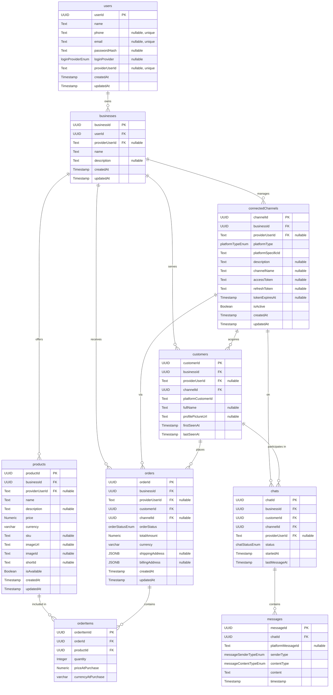

# Project Architecture Documentation

This document outlines the architecture for the database schema, backend services, and the Next.js API routes.

## 1. Database Schema (`db/schema.ts`)

The database schema is defined using Drizzle ORM and resides in `db/schema.ts`. It is designed to support a multi-user, multi-business, multi-channel customer interaction platform.

### 1.1. Core Entities and Fields

Below is a description of the main tables and their fields, reflecting the new "business" centric model:

**Table: `users`**
Stores information about individual users of the platform. A user can own multiple businesses.

| Column             | Type                                  | Constraints                            | Description                                      |
|--------------------|---------------------------------------|----------------------------------------|--------------------------------------------------|
| `userId`           | `uuid`                                | PK, `default gen_random_uuid()`        | Primary unique identifier for the user.          |
| `name`             | `text`                                | Not Null                               | User's display name.                             |
| `phone`            | `text`                                | Unique, Nullable                       | User's phone number.                             |
| `email`            | `text`                                | Unique, Nullable                       | User's email address.                            |
| `passwordHash`     | `text`                                | Nullable                               | Hashed password for email/password authentication. |
| `loginProvider`    | `loginProviderEnum`                   | Nullable                               | The OAuth provider used for login (EMAIL, GOOGLE, etc.). |
| `providerUserId`   | `text`                                | Unique, Nullable                       | User ID from the OAuth provider (e.g., Firebase UID, Google ID). |
| `createdAt`        | `timestamp`                           | Not Null, `default now()`              | Timestamp of user creation.                      |
| `updatedAt`        | `timestamp`                           | Not Null, `default now()`              | Timestamp of last user update.                   |
*Relations: Has many `businesses` (primary ownership). Denormalized links to `connectedChannels`, `products`, `customers`, `orders`, `chats` via `providerUserId` for easier querying.*

**Table: `businesses`**
Represents a distinct business owned by a `user`. All core business entities (channels, products, customers, orders, chats) belong to a business.

| Column             | Type                                  | Constraints                            | Description                                      |
|--------------------|---------------------------------------|----------------------------------------|--------------------------------------------------|
| `businessId`       | `uuid`                                | PK, `default gen_random_uuid()`        | Unique identifier for the business.              |
| `userId`           | `uuid`                                | FK to `users.userId`, Not Null         | The primary user who owns this business.         |
| `providerUserId`   | `text`                                | FK to `users.providerUserId`, Nullable | Denormalized: User ID from the OAuth provider.   |
| `name`             | `text`                                | Not Null                               | Name of the business.                            |
| `description`      | `text`                                | Nullable                               | A short description or motto for the business.   |
| `createdAt`        | `timestamp`                           | Not Null, `default now()`              | Timestamp of business creation.                  |
| `updatedAt`        | `timestamp`                           | Not Null, `default now()`              | Timestamp of last business update.               |
*Relations: Belongs to `user` (primary), `userViaProviderId` (denormalized). Has many `connectedChannels`, `products`, `customers`, `orders`.*

**Table: `connectedChannels`**
Manages connections to various external platforms for each `business`.

| Column               | Type                 | Constraints                                  | Description                                         |
|----------------------|----------------------|----------------------------------------------|-----------------------------------------------------|
| `channelId`          | `uuid`               | PK, `default gen_random_uuid()`              | Unique identifier for the connected channel.        |
| `businessId`         | `uuid`               | FK to `businesses.businessId`, Not Null      | Owning business.                                    |
| `providerUserId`     | `text`               | FK to `users.providerUserId`, Nullable       | Denormalized: User ID from OAuth provider (owner of this channel via business). |
| `platformType`       | `platformTypeEnum`   | Not Null                                     | Type of platform (FACEBOOK_PAGE, INSTAGRAM_BUSINESS, etc.). |
| `platformSpecificId` | `text`               | Not Null                                     | ID from the external platform specific to this channel. |
| `description`        | `text`               | Nullable                                     | Optional description for the channel.               |
| `channelName`        | `text`               | Nullable                                     | User-defined name for the channel.                  |
| `accessToken`        | `text`               | Nullable (Should be encrypted in application logic) | Encrypted access token for the platform API.        |
| `refreshToken`       | `text`               | Nullable (Should be encrypted)               | Encrypted refresh token.                            |
| `tokenExpiresAt`     | `timestamp`          | Nullable                                     | Expiry time for the access token.                   |
| `isActive`           | `boolean`            | `default true`, Not Null                     | Whether the channel connection is active.           |
| `createdAt`          | `timestamp`          | Not Null, `default now()`                    | Timestamp of channel creation.                      |
| `updatedAt`          | `timestamp`          | Not Null, `default now()`                    | Timestamp of last channel update.                   |
*Relations: Belongs to `business`, `userViaProviderId` (denormalized). Has many `customers`, `orders`, `chats`.*

**Table: `products`**
Stores product information for each `business`.

| Column        | Type          | Constraints                                  | Description                                      |
|---------------|---------------|----------------------------------------------|--------------------------------------------------|
| `productId`   | `uuid`        | PK, `default gen_random_uuid()`              | Unique identifier for the product.               |
| `businessId`  | `uuid`        | FK to `businesses.businessId`, Not Null      | Business that owns this product.                 |
| `providerUserId`| `text`      | FK to `users.providerUserId`, Nullable       | Denormalized: User ID from OAuth provider (owner of the business that owns this product). |
| `name`        | `text`        | Not Null                                     | Product name.                                    |
| `description` | `text`        | Nullable                                     | Product description.                             |
| `price`       | `numeric(10,2)` | Not Null                                     | Product price.                                   |
| `currency`    | `varchar(3)`  | Not Null                                     | Currency code (e.g., "USD").                     |
| `sku`         | `text`        | Nullable                                     | Stock Keeping Unit.                              |
| `imageUrl`    | `text`        | Nullable                                     | URL to the product image.                        |
| `imageId`     | `text`        | Nullable                                     | Optional ID for an image associated with the product. |
| `shortId`     | `text`        | Nullable                                     | Optional short identifier for the product.       |
| `isAvailable` | `boolean`     | `default true`, Not Null                     | Whether the product is available for sale.       |
| `createdAt`   | `timestamp`   | Not Null, `default now()`                    | Timestamp of product creation.                   |
| `updatedAt`   | `timestamp`   | Not Null, `default now()`                    | Timestamp of last product update.                |
*Relations: Belongs to `business`, `userViaProviderId` (denormalized). Has many `orderItems`.*

**Table: `customers`**
Represents end-customers interacting via `connectedChannels` and belonging to a `business`.

| Column               | Type        | Constraints                                  | Description                                      |
|----------------------|-------------|----------------------------------------------|--------------------------------------------------|
| `customerId`         | `uuid`      | PK, `default gen_random_uuid()`              | Unique identifier for the customer.              |
| `businessId`         | `uuid`      | FK to `businesses.businessId`, Not Null      | Business this customer belongs to.               |
| `providerUserId`     | `text`      | FK to `users.providerUserId`, Nullable       | Denormalized: User ID from OAuth provider (owner of the business this customer belongs to). |
| `channelId`          | `uuid`      | FK to `connectedChannels.channelId`, Not Null| Channel through which customer interacted/was acquired. |
| `platformCustomerId` | `text`      | Not Null                                     | Customer ID from the external platform (unique per channel). |
| `fullName`           | `text`      | Nullable                                     | Customer's full name.                            |
| `profilePictureUrl`  | `text`      | Nullable                                     | URL to customer's profile picture.               |
| `firstSeenAt`        | `timestamp` | Not Null, `default now()`                    | Timestamp of first interaction.                  |
| `lastSeenAt`         | `timestamp` | Not Null, `default now()`                    | Timestamp of last interaction.                   |
*Relations: Belongs to `business`, `userViaProviderId` (denormalized), `connectedChannel`. Has many `orders`, `chats`.*

**Table: `orders`**
Tracks customer orders for a specific `business`.

| Column            | Type                | Constraints                                  | Description                                      |
|-------------------|---------------------|----------------------------------------------|--------------------------------------------------|
| `orderId`         | `uuid`              | PK, `default gen_random_uuid()`              | Unique identifier for the order.                 |
| `businessId`      | `uuid`              | FK to `businesses.businessId`, Not Null      | Business this order belongs to.                  |
| `providerUserId`  | `text`              | FK to `users.providerUserId`, Nullable       | Denormalized: User ID from OAuth provider (owner of the business this order belongs to). |
| `customerId`      | `uuid`              | FK to `customers.customerId`, Not Null       | Customer who placed the order.                   |
| `channelId`       | `uuid`              | FK to `connectedChannels.channelId`, Nullable| Channel through which order was placed (optional link). |
| `orderStatus`     | `orderStatusEnum`   | Not Null, `default 'PENDING'`                | Status of the order.                             |
| `totalAmount`     | `numeric(10,2)`     | Not Null                                     | Total amount of the order.                       |
| `currency`        | `varchar(3)`        | Not Null                                     | Currency code for the order.                     |
| `shippingAddress` | `jsonb`             | Nullable                                     | Shipping address details.                        |
| `billingAddress`  | `jsonb`             | Nullable                                     | Billing address details.                         |
| `createdAt`       | `timestamp`         | Not Null, `default now()`                    | Timestamp of order creation.                     |
| `updatedAt`       | `timestamp`         | Not Null, `default now()`                    | Timestamp of last order update.                  |
*Relations: Belongs to `business`, `userViaProviderId` (denormalized), `customer`, `connectedChannel` (optional). Has many `orderItems`.*

**Table: `orderItems`**
Line items for an order. This table structure remains largely unchanged as it's a detail of an order.

| Column               | Type            | Constraints                                  | Description                                      |
|----------------------|-----------------|----------------------------------------------|--------------------------------------------------|
| `orderItemId`        | `uuid`          | PK, `default gen_random_uuid()`              | Unique identifier for the order item.            |
| `orderId`            | `uuid`          | FK to `orders.orderId`, Not Null             | Order this item belongs to.                      |
| `productId`          | `uuid`          | FK to `products.productId`, Not Null         | Product associated with this item.               |
| `quantity`           | `integer`       | Not Null                                     | Quantity of the product ordered.                 |
| `priceAtPurchase`    | `numeric(10,2)` | Not Null                                     | Price of the product at the time of purchase.    |
| `currencyAtPurchase` | `varchar(3)`    | Not Null                                     | Currency at the time of purchase.                |
*Relations: Belongs to `order`, `product`.*

**Table: `chats`**
Represents chat conversations, belonging to a `business`.

| Column           | Type             | Constraints                                  | Description                                      |
|------------------|------------------|----------------------------------------------|--------------------------------------------------|
| `chatId`         | `uuid`           | PK, `default gen_random_uuid()`              | Unique identifier for the chat.                  |
| `businessId`     | `uuid`           | FK to `businesses.businessId`, Not Null      | Business this chat belongs to.                   |
| `customerId`     | `uuid`           | FK to `customers.customerId`, Not Null       | Customer involved in the chat.                   |
| `channelId`      | `uuid`           | FK to `connectedChannels.channelId`, Not Null| Channel on which chat occurred.                  |
| `providerUserId` | `text`           | FK to `users.providerUserId`, Nullable       | Denormalized: User ID from OAuth provider (e.g., the agent handling the chat). |
| `status`         | `chatStatusEnum` | Not Null, `default 'OPEN'`                   | Status of the chat.                              |
| `startedAt`      | `timestamp`      | Not Null, `default now()`                    | Timestamp when chat started.                     |
| `lastMessageAt`  | `timestamp`      | Not Null, `default now()`                    | Timestamp of the last message in the chat.       |
*Relations: Belongs to `business`, `userViaProviderId` (denormalized), `customer`, `connectedChannel`. Has many `messages`.*

**Table: `messages`**
Individual messages within a chat. This table structure remains largely unchanged as it is nested under `chats`.

| Column              | Type                      | Constraints                                  | Description                                      |
|---------------------|---------------------------|----------------------------------------------|--------------------------------------------------|
| `messageId`         | `uuid`                    | PK, `default gen_random_uuid()`              | Unique identifier for the message.               |
| `chatId`            | `uuid`                    | FK to `chats.chatId`, Not Null               | Chat this message belongs to.                    |
| `platformMessageId` | `text`                    | Nullable                                     | Message ID from the external platform.           |
| `senderType`        | `messageSenderTypeEnum`   | Not Null                                     | Who sent the message (BOT, CUSTOMER, AGENT).     |
| `contentType`       | `messageContentTypeEnum`  | Not Null                                     | Type of message content (TEXT, IMAGE, AUDIO).    |
| `content`           | `text`                    | Not Null                                     | Message content (text or URL for media).         |
| `timestamp`         | `timestamp`               | Not Null, `default now()`                    | Timestamp when message was sent/received.        |
*Relations: Belongs to `chat`.*

### 1.2. Enum Types

The schema defines several PostgreSQL enum types for consistency. These remain as defined:

*   `loginProviderEnum`: For `users.loginProvider` (e.g., 'EMAIL', 'GOOGLE', 'FACEBOOK', 'LINKEDIN', 'TWITTER', 'INSTAGRAM')
*   `platformTypeEnum`: For `connectedChannels.platformType` (e.g., 'FACEBOOK_PAGE', 'INSTAGRAM_BUSINESS', 'LINKEDIN_PAGE', 'TWITTER_PROFILE')
*   `orderStatusEnum`: For `orders.orderStatus` (e.g., 'PENDING', 'CONFIRMED', 'PROCESSING', 'SHIPPED', 'CANCELLED')
*   `chatStatusEnum`: For `chats.status` (e.g., 'OPEN', 'CLOSED_BY_BOT', 'CLOSED_BY_AGENT', 'ARCHIVED')
*   `messageSenderTypeEnum`: For `messages.senderType` (e.g., 'BOT', 'CUSTOMER', 'AGENT')
*   `messageContentTypeEnum`: For `messages.contentType` (e.g., 'TEXT', 'IMAGE', 'AUDIO')

### 1.3. Mermaid Diagram (Entity Relationship Diagram)


This diagram provides a visual overview of the updated table relationships.

---

## 2. Backend Services Architecture

The backend services are responsible for handling business logic and data persistence. They are designed to be modular and interact with the database via Drizzle ORM.

### 2.1. Directory Structure

Services are organized within the `backend/services/` directory. Each entity now has its own subdirectory, with `businesses` as a new top-level entity:

```
backend/
└── services/
    ├── businesses/
    │   ├── businesses.service.ts  // New: Business logic for managing businesses
    │   └── businesses.types.ts    // New: Type definitions for businesses
    ├── [entityName]/
    │   ├── [entityName].service.ts
    │   └── [entityName].types.ts
    ├── users/
    │   ├── users.service.ts
    │   └── users.types.ts
    ├── products/
    │   ├── products.service.ts
    │   └── products.types.ts
    ├── channels/
    │   ├── channels.service.ts
    │   └── channels.types.ts
    ├── customers/
    │   ├── customers.service.ts
    │   └── customers.types.ts
    ├── orders/
    │   ├── orders.service.ts
    │   └── orders.types.ts
    ├── chats/
    │   ├── chats.service.ts
    │   └── chats.types.ts
    └── messages/
        ├── messages.service.ts
        └── messages.types.ts
```

### 2.2. Service Files (`*.service.ts`)

*   **Purpose:** Encapsulate all business logic related to a specific entity. This includes creating, reading, updating, and deleting (CRUD) operations, as well as any other entity-specific logic.
*   **Database Interaction:** Service files directly interact with the database using the Drizzle ORM client (`db` imported from `@/db`).
*   **Structure:** Each service is implemented as a class (e.g., `UsersService`, `BusinessesService`) with methods corresponding to various operations. An instance of the service is usually exported for use in API route handlers.
*   **Key Changes:**
    *   **New `BusinessesService`**: Manages business creation, retrieval, and updates.
    *   **Updated Services (`channels`, `products`, `customers`, `orders`, `chats`)**: Now primarily linked to `businesses` via `businessId`. Many also include a `providerUserId` for denormalized access to the owning user.
    *   **`UsersService`**: No longer handles `businessName`. Its `updateManyUsers` method is currently commented out as its data structure needs re-evaluation.
    *   **`MessagesService`**: Remains largely unchanged as messages are linked to `chats`, which now carry the business/user context.
*   **Relational Data:** Services extensively use Drizzle's relational query capabilities (`db.query.[entity].findFirst/findMany({ with: { ... } })`) to fetch related data (e.g., a business's channels, a user's businesses). Note that `offset` for nested `with` relations is not directly supported by Drizzle ORM in the service layer.
*   **Transactions:** For operations involving multiple database writes (e.g., creating an order and its items, or `handleNewMessage` in `chats.service`), Drizzle transactions (`db.transaction(async (tx) => { ... })`) are used to ensure atomicity.

### 2.3. Type Definition Files (`*.types.ts`)

*   **Purpose:** Define all TypeScript types related to an entity. This ensures type safety throughout the application.
*   **Core Types:**
    *   `Entity`: Derived from the Drizzle schema using `InferSelectModel<typeof schema.[entityTable]>`. Represents the shape of data retrieved from the database.
    *   `NewEntity`: Derived from the Drizzle schema using `InferInsertModel<typeof schema.[entityTable]>`. Represents the shape of data for creating new records.
*   **Custom Types:**
    *   `CreateEntityData`: Defines the data structure required to create a new entity. Now commonly includes `businessId` and an optional `providerUserId`. For `businesses`, it now implicitly includes a `description` field.
    *   `UpdateEntityData`: Defines the data structure for updating an entity. `businessId` and primary `FK`s are typically excluded from direct updates. For `businesses`, it now implicitly includes a `description` field for updates.
    *   `GetEntityByIdOptions`, `GetAllEntitiesOptions`: Define options for fetching entities, including pagination, filtering, and inclusion of related data. These now frequently include `businessId` and `providerUserId` in their filter options.
    *   `EntityFilterOptions`: Defines specific filter criteria for querying entities, often used for bulk operations.
    *   `EntityWithIncludes`: Defines the shape of an entity when related data (including `business` and `userViaProviderId`) is eagerly loaded.

### 2.4. Database Setup (`db/index.ts`)

*   Initializes and exports the Drizzle ORM client instance (`db`).
*   Configured to connect to a Neon serverless Postgres database using the `@neondatabase/serverless` driver and `drizzle-orm/neon-http` adapter.
*   The database connection string is expected to be provided via the `DATABASE_URL` environment variable.

### 2.5. ESLint Configuration (`eslint.config.mjs`)

*   The `@typescript-eslint/no-unused-vars` rule has been globally disabled (`"off"`).
*   **Reasoning:** Drizzle ORM's relational query system often requires importing schema table objects (e.g., `import { users, orders } from '@/db/schema'`) into service files for type inference and query building, even if these imported table objects are not explicitly used as standalone variables within the service file's code. Disabling this rule prevents ESLint errors for these legitimate, Drizzle-specific use cases. This also applies to type definition files (`*.types.ts`) where schema objects might be imported for type derivation but not directly used as values.

## 3. Next.js API Routes Architecture (App Router)

API routes are built using Next.js App Router conventions, residing in the `app/api/` directory.

### 3.1. Directory Structure

API routes are organized by entity, following RESTful patterns. A new `businesses` endpoint has been introduced. Note that dedicated HTTP API routes for `messages` are not present, suggesting WebSocket-based handling for real-time messaging.

```
app/
└── api/
    ├── businesses/
    │   ├── route.ts                     // Handles /api/businesses (GET all, POST create)
    │   └── [businessId]/                // Dynamic segment for a specific business
    │       └── route.ts                 // Handles /api/businesses/[businessId] (GET one, PUT update, DELETE one)
    ├── [entityName]/
    │   ├── route.ts
    │   └── [entityId]/
    │       └── route.ts
    ├── users/
    │   ├── route.ts
    │   └── [userId]/
    │       └── route.ts
    ├── products/
    │   ├── route.ts
    │   └── [productId]/
    │       └── route.ts
    ├── channels/
    │   ├── route.ts
    │   └── [channelId]/
    │       └── route.ts
    ├── customers/
    │   ├── route.ts
    │   └── [customerId]/
    │       └── route.ts
    ├── orders/
    │   ├── route.ts
    │   └── [orderId]/
    │       └── route.ts
    ├── chats/
    │   ├── route.ts
    │   └── [chatId]/
    │       └── route.ts
    └── messages/
        // No direct HTTP API routes for messages, suggesting WebSocket-based handling.
        // However, a sub-resource for messages within chats might exist if needed.
        // E.g., app/api/chats/[chatId]/messages/route.ts (not present in file list, but common pattern)
```

### 3.2. Route Handlers (`route.ts`)

*   **HTTP Methods:** Each `route.ts` file exports async functions corresponding to HTTP methods (e.g., `export async function GET(request: NextRequest, { params }) { ... }`, `POST`, `PUT`, `DELETE`).
*   **Request & Response:** Utilize `NextRequest` for accessing request details and `NextResponse.json()` for sending JSON responses with appropriate status codes.
*   **Service Integration:** Route handlers call methods from the corresponding backend service (e.g., `businessesService.createBusiness(...)`, `channelsService.getAllChannels(...)`).
*   **Input Validation:**
    *   Request bodies, query parameters, and path parameters will be validated (currently with basic checks, `TODO: Add validation with Zod`).
    *   Zod schemas will be defined either co-located with routes or in a shared validation module.
*   **Error Handling:**
    *   `try...catch` blocks are used to handle errors from service calls or validation.
    *   Validation errors (e.g., missing required fields) return a `400 Bad Request`.
    *   Not Found errors (e.g., for `GET /api/entity/[id]`) return a `404 Not Found`.
    *   Specific errors like unique constraint violations can return `409 Conflict`.
    *   Other server-side errors return a `500 Internal Server Error` with a generic message, and actual errors are logged server-side.
*   **Authentication & Authorization:** (Conceptual) Protected routes would typically involve middleware or checks at the beginning of each handler to verify user authentication and authorization. This is not yet fully implemented but is a key consideration. All routes now implicitly require association with a `businessId` or `providerUserId` for data access.

### 3.3. Planned API Endpoints (Summary)

For each major entity (users, businesses, products, channels, customers, orders, chats), the following general API endpoints are planned and largely implemented:

*   **`POST /api/[entity]`**: Create a new entity (requires `businessId` for most entities, `userId` for `businesses`, and correct `providerUserId` handling).
*   **`GET /api/[entity]`**: Get a list of entities (with pagination and filtering by `businessId`, `providerUserId`, and other relevant fields).
*   **`GET /api/[entity]/[id]`**: Get a single entity by its ID (supports `include` query parameter for relations).
*   **`PUT /api/[entity]/[id]`**: Update an entity by its ID.
*   **`DELETE /api/[entity]/[id]`**: Delete an entity by its ID.

Note: Direct HTTP endpoints for `messages` are not present, implying a real-time (e.g., WebSocket) communication strategy for message exchange.

This document provides a comprehensive and up-to-date foundation for understanding the project's architecture.
